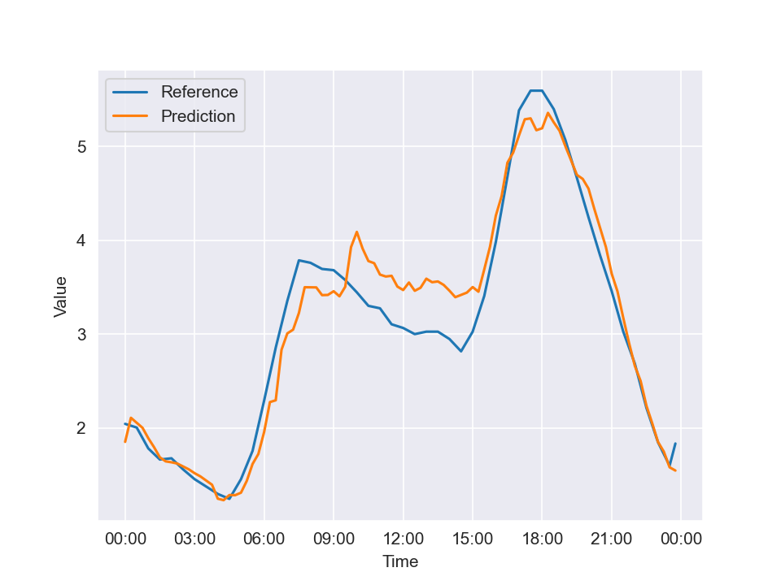

# EmuCast

**EmuCast** is a lightweight, flexible Python package for emulating 
time-series forecasts with controllable error 
levels. It uses a Markov Chain Monte Carlo (MCMC) method and a reshaping approach 
to generate realistic synthetic forecasts for time series with daily patterns at hourly 
or sub-hourly resolutions. Designed for researchers and engineers—especially in 
operations research and control engineering — it enables developing and testing
predictive control strategies without requiring forecasting expertise.

The tool is simple (built around one core class with two main parameters), 
fast (able to produce a three-day, 15-minute resolution forecast in under one second), 
and versatile (works with electricity consumption, PV generation, energy prices, etc.) 
without calibration. Forecast errors naturally increase with the prediction horizon, 
allowing users to study the effect of uncertainty on system performance. **EmuCast** includes
sample datasets and example notebooks demonstrating its use in energy-related simulations,
providing a practical and efficient way to evaluate and improve the robustness of predictive 
strategies.

---

## Installation

You can install directly from GitHub:

```bash
pip install git+https://github.com/RemyRigo/EmuCast.git
```

Or, for development (editable) mode:

```bash
git clone https://github.com/RemyRigo/EmuCast.git
cd EmuCast
pip install -e .
```
## Class : ForecatEmulator

### Initialization

```python
ForecastEmulator.__init__( ts_in: pd.Series,  # input Pandas time serie
                           nb_states: int = 30,  # number of states at every time steps
                           nb_forecast_profiles: int = 300 # numbers of forecast scenarios profiles
                          )
```

`ForecastEmulator.__init__`:
- checks that the input `data` is a valid time serie, infers a regular timestep.
- infers a regular time step (in minutes).
- generates the possbile states at each time steps within a day  : `emulator.states_maps`.
- diretises the input time series along the entire horizons with the sets of states defined.
- generates a state transition matrix at each daily time step for Markov Models : `emulator.trans_matrices`.

### Forecast Generation

```python
ForecastEmulator.forecast( start_time : datetime,  # start datetime for the forecast
                           duration_minutes : int, # forecast horizon 
                           target_error : float,  # desired error value (in %)
                           reference : pd.Series = None, # reference time series, if None ForecastEmulator.ts_in
                           n_profiles : int = 300, # if None ForecastEmulator.nb_forecast_profiles 
                           metric : str = "nrmse", # error metric ['nrmse', 'nmae', 'eof']
                           selection : str = 'closest' # profile selection before forecast tuning  ['closest', 'median']
                          )
```
`ForecastEmulator.forecast`:
- checks that the inputs `start_time` and `start_time` (if provided)  are valid.
- generates several profiles based on the transition matrics and `duration_minutes`.
- compute errors values from the reference with the given `metric` for all the profiles.
- select and tune a a single profile to match `start_time` value with the given `metric`.


## Simple Example - power load profile

```python
# Import the main class and data loader
from emucast import ForecastEmulator
from emucast.data import load_sample_data

# Initialize the emulator with the sample data
emulator = ForecastEmulator(load_sample_data)

# Generate Forecast profiles
from datetime import datetime
ref, pred = emulator.forecast( start_time = datetime(2019,1,9,0,0),
                               duration_minutes = 60*24,
                               target_error = 10 )
```



## Notebooks

- `dev_test.ipynb` : a notebook used to test the core functionalities of the class with some performances analysis.

- `da_market.ipynb` : an operational planning application with an energy storage participating in day-aheed 
electricity market based on daily price forecasts.

- `ems_rolling.ipynb` : an energy management strategy (EMS) for a system : load + solar generation + storage. The EMS 
is run on a rolling windows basis with successive forecast updates over time.

## Sample Data

Sample time series from open data sets are included in the package (`emucast.data`) with :
- a residential electircal load 
(in kW), solar generation profile (in kW) - [source](https://www.kaggle.com/datasets/pythonafroz/electricity-demand-and-solar-generation-data-uk/data)
- and day-ahead energy prices (in €/MWh) - [source](https://newtransparency.entsoe.eu)

```python
from emucast.data import load_sample_data, pv_sample_data, price_sample_data
```
